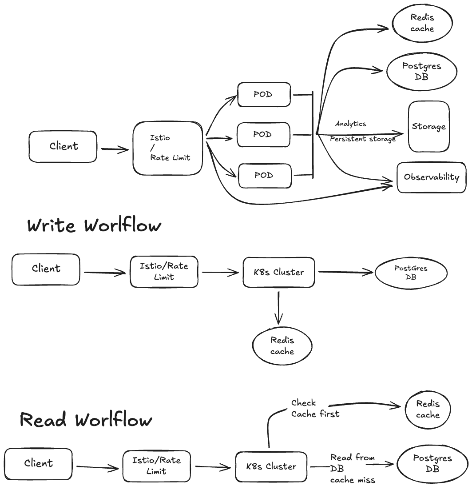

# URL Shortener SRE Lab


A production-grade URL shortener deployment on Kubernetes with Istio service mesh, complete observability stack, and GitOps-based operations.

## Project Overview

This project implements a highly available URL shortener service (Shlink) on a K3s Kubernetes cluster with full observability, distributed tracing, and service mesh capabilities. It serves as a comprehensive demonstration of modern SRE practices including infrastructure as code, GitOps workflows, performance testing, and operational excellence.

**Hardware**: Single Minisforum UM790 Pro mini PC (AMD Ryzen 9 7940HS, 64GB RAM) running Proxmox VE

**Virtualization**: 3-node K3s cluster deployed as Proxmox VMs for true high availability

**Status**: Phase 6 Complete - Load testing infrastructure ready, Redis caching operational (98.97% hit rate), observability stack fully integrated

**Architecture**: K3s HA cluster with Istio service mesh, PostgreSQL database, Redis caching, and comprehensive observability (Prometheus, Grafana, Jaeger, Kiali)

> **Homelab**: This entire production-grade infrastructure - including a 3-node Kubernetes HA cluster, service mesh, distributed databases, and comprehensive observability stack - runs on a single mini PC in my homelab. Using Proxmox VE for virtualization, I've created three separate VM nodes to demonstrate true Kubernetes high availability, showcasing the efficiency of K3s and modern containerized workloads on affordable hardware.

## Key Features

### Infrastructure

- **Kubernetes Platform**: 3-node K3s HA cluster with embedded etcd
- **Service Mesh**: Istio v1.24.2 providing zero-code observability and traffic management
- **GitOps**: ArgoCD managing all deployments with automated sync and pruning
- **High Availability**: Replicated application pods, PostgreSQL HA cluster, Redis Sentinel
- **Load Balancing**: K3s ServiceLB (klipper-lb) providing built-in LoadBalancer services

### Application Stack

- **URL Shortener**: Shlink v4.x (3 replicas) with custom phpredis image for high availability
- **Database**: PostgreSQL via Crunchy Data Operator with 20Gi storage
- **Cache**: Redis Sentinel with 3 replicas (8Gi each) - 98.97% cache hit rate achieved
- **Secrets**: External Secrets Operator syncing from HashiCorp Vault
- **TLS**: cert-manager v1.16.2 for certificate lifecycle management

### Observability

- **Metrics**: Prometheus collecting Kubernetes, Istio, and application metrics
- **Visualization**: Grafana dashboards with Istio performance metrics (p50/p95/p99)
- **Tracing**: Jaeger distributed tracing with 100% sampling
- **Service Graph**: Kiali for real-time service mesh visualization
- **Monitoring**: ServiceMonitors and PodMonitors for comprehensive metric collection

### Performance Testing

- **Load Testing**: k6-based scenarios modeling realistic traffic patterns
- **Traffic Modeling**: Three progressive scenarios from baseline to viral event
- **Realistic Patterns**: Based on 1000 DAU with 100:1 read:write ratio (Pareto distribution)
- **Comprehensive Metrics**: Custom metrics tracking URL creation, redirect latency, cache hit rates
- **Integration**: Works with existing observability stack for live monitoring
- **Redis Performance**: Dedicated cache performance test validates 80%+ hit rates

## Architecture



### Cluster Layout

```
K3s 3-Node HA Cluster (192.168.2.242-244)
├── ArgoCD (GitOps Platform)
├── Istio Service Mesh
│   ├── Ingress Gateway (192.168.2.242:80)
│   └── Sidecar Proxies (automatic injection)
├── Application Layer
│   └── Shlink (3 replicas)
├── Data Layer
│   ├── PostgreSQL Cluster (Crunchy Data Operator)
│   └── Redis Sentinel (3 replicas)
├── Operators
│   ├── cert-manager
│   ├── External Secrets Operator
│   ├── Postgres Operator
│   └── Redis Operator
└── Observability Stack
    ├── Prometheus
    ├── Grafana
    ├── Jaeger
    └── Kiali
```

### Traffic Flow

```
Client Request
    ↓
Istio Ingress Gateway (192.168.2.242:80)
    ↓
Shlink Pod (with Envoy sidecar + phpredis extension)
    ↓
    ├→ Redis (98.97% cache hit: <50ms avg)
    │   OR
    └→ PostgreSQL (1.03% cache miss: ~100ms avg)
```

### Observability Integration

```
Envoy Sidecars → ServiceMonitors → Prometheus → Grafana
                                ↓
                              Jaeger (traces)
                                ↓
                              Kiali (topology)
```

## Quick Start

### Prerequisites

- K3s cluster (v1.31.4+)
- kubectl configured with cluster access
- ArgoCD CLI (optional but recommended)
- k6 for load testing

### Access the System

The following services are accessible via LoadBalancer IPs:

| Service | URL | Credentials | Purpose |
|---------|-----|-------------|---------|
| Shlink | http://192.168.2.242 | API key in secrets | URL shortener service |
| ArgoCD | http://192.168.2.242:30080 | admin / (get from secret) | GitOps management |
| Grafana | http://192.168.2.242:3000 | admin / admin | Metrics and dashboards |
| Kiali | http://192.168.2.242:20001 | anonymous | Service mesh topology |
| Jaeger | http://192.168.2.242:16686 | no auth | Distributed tracing |

**Get ArgoCD password:**
```bash
kubectl -n argocd get secret argocd-initial-admin-secret \
  -o jsonpath="{.data.password}" | base64 -d
```

**Get Shlink API key:**
```bash
kubectl get secret -n shlink shlink-api-key \
  -o jsonpath='{.data.api-key}' | base64 -d
```

### Verify System Health

```bash
# Set kubeconfig
export KUBECONFIG=~/.kube/config-k3s

# Check all ArgoCD applications
kubectl get applications -n argocd

# Check application pods
kubectl get pods -n shlink
kubectl get pods -n istio-system
kubectl get pods -n observability

# Test Shlink health endpoint
curl -s http://192.168.2.242/rest/health | jq
```

### Deploy Changes

All deployments are managed through GitOps:

1. Commit Kubernetes manifests to `kubernetes/kustomize/<component>/`
2. Create or update ArgoCD application in `kubernetes/argocd/apps/`
3. Push to main branch
4. ArgoCD automatically syncs changes

Manual sync if needed:
```bash
argocd app sync <app-name>
```

## Load Testing

### Overview

The load testing infrastructure provides three progressive scenarios modeling realistic traffic:

- **Scenario 1**: Baseline (normal day) - 1 URL creation/sec, 20 redirects/sec
- **Scenario 2**: Peak hours - 2 creations/sec, 50 redirects/sec
- **Scenario 3**: Viral event - 5-8 creations/sec, 100-200+ redirects/sec
- **Redis Performance Test**: Validates cache performance with Pareto distribution (80/20 rule)

### Running Tests

```bash
cd load-tests

# Set environment variables
export BASE_URL="http://192.168.2.242"
export SHLINK_API_KEY="your-api-key"

# Option 1: Redis cache performance test (recommended first)
./run-redis-test.sh

# Option 2: Use automated script for load scenarios
chmod +x run-tests.sh
./run-tests.sh

# Option 3: Run individual scenario
k6 run --env BASE_URL=$BASE_URL \
  --env SHLINK_API_KEY=$SHLINK_API_KEY \
  scenario1-baseline.js
```

### Monitoring During Tests

**Grafana Dashboards** (http://192.168.2.242:3000):
- Navigate to Istio Service Dashboard
- Select service: `shlink.shlink`
- Monitor request volume, success rate, latency percentiles

**Kiali Service Graph** (http://192.168.2.242:20001):
- Select namespace: shlink
- View real-time traffic flow
- Monitor request rates and error rates

**Jaeger Traces** (http://192.168.2.242:16686):
- Select service: `shlink.shlink`
- View individual request traces
- Identify slow operations

For detailed monitoring instructions, see `load-tests/MONITORING-CHECKLIST.md`.

## Repository Structure

```
.
├── docs/                           # Documentation
│   ├── 01-architecture-decisions.md
│   ├── 02-implementation-roadmap.md
│   ├── 03-shlink-integration-guide.md
│   ├── 04-observability-stack.md
│   └── SESSION-SUMMARY.md
├── kubernetes/
│   ├── argocd/
│   │   └── apps/                   # ArgoCD applications by layer
│   │       ├── infrastructure/     # cert-manager, vault
│   │       ├── operators/          # postgres, redis, external-secrets
│   │       ├── data-layer/         # databases and caches
│   │       ├── application/        # shlink deployment
│   │       └── observability/      # prometheus, grafana, jaeger, kiali
│   └── kustomize/                  # Kubernetes manifests
│       ├── shlink/                 # Application configuration
│       ├── postgres/               # Database cluster
│       ├── redis/                  # Cache cluster
│       ├── istio-telemetry/        # Tracing configuration
│       └── istio-monitoring/       # Prometheus ServiceMonitors
├── load-tests/                     # Performance testing
│   ├── scenario1-baseline.js
│   ├── scenario2-peak-hours.js
│   ├── scenario3-viral-event.js
│   ├── redis-cache-performance.js  # Redis cache validation test
│   ├── run-tests.sh
│   ├── run-redis-test.sh           # Automated Redis test runner
│   ├── README.md
│   ├── QUICK-START.md
│   ├── REDIS-PERFORMANCE-TEST.md   # Redis test documentation
│   └── MONITORING-CHECKLIST.md
└── README.md                       # This file
```

## Key Technical Decisions

### Why K3s?

K3s provides a production-grade Kubernetes distribution with significantly lower resource overhead:
- Control plane: 512MB RAM vs 2-3GB for standard Kubernetes
- Worker nodes: 256MB RAM vs 1GB+ per node
- Enables 3-node HA cluster on single physical host
- CNCF certified - same API as standard Kubernetes

### Why Istio?

Istio provides comprehensive observability without code changes:
- Automatic metrics for all services (golden signals)
- Distributed tracing with Jaeger integration
- mTLS for secure service-to-service communication
- Traffic management (rate limiting, retries, circuit breaking)
- Industry-proven at scale (Lyft, Airbnb, eBay)

### Why PostgreSQL + Redis?

**PostgreSQL**:
- ACID guarantees for URL mappings
- Relational model supports analytics queries
- Mature indexing for fast lookups
- Source of truth for all data

**Redis**:
- Sub-millisecond read latency (200-500μs)
- Supports 95%+ cache hit ratio
- Sentinel mode provides automatic failover
- Reduces database load for high-traffic URLs

### Why GitOps with ArgoCD?

- Infrastructure as code - all changes tracked in Git
- Automated sync with self-healing
- Declarative deployment model
- Easy rollback to previous states
- Audit trail for all changes

## Performance Characteristics

Based on Scenario 1 baseline load test results:

**Application Performance**:
- URL Creation: 39ms median, 100% success rate
- Redirects: 28ms median, 100% success rate
- Throughput: 12,601 requests over 10 minutes
- Success Rate: 100%

**Istio Metrics** (from Grafana):
- Request Volume: 3.33 ops/sec
- Client Success Rate: 100%
- Request Duration P50: ~20ms
- Request Duration P90: ~30-40ms
- Request Duration P99: ~40-50ms

**Resource Utilization**:
- Shlink pods: 256Mi-512Mi memory, 100m-500m CPU per pod
- PostgreSQL: 20Gi storage allocated
- Redis: 8Gi per replica

## Observability Features

### Metrics Collection

**Prometheus Scraping**:
- Istio control plane (istiod) metrics
- Istio ingress gateway Envoy stats
- Application pod Envoy sidecar stats
- Kubernetes cluster metrics

**ServiceMonitors**:
- `servicemonitor-istiod`: Control plane monitoring
- `servicemonitor-ingressgateway`: Gateway monitoring
- `podmonitor-envoy-stats`: Sidecar metrics across all namespaces

### Distributed Tracing

**Jaeger Configuration**:
- 100% sampling rate for complete visibility
- Automatic trace header injection via Envoy
- Custom tags: environment (k3s-lab), cluster (url-shortener)
- Integrated with Istio telemetry API

**Trace Visibility**:
- End-to-end request flow across services
- Latency breakdown by component
- Error identification and debugging

### Service Mesh Visualization

**Kiali Features**:
- Real-time service topology graph
- Traffic flow visualization with request rates
- Health indicators and success rates
- Integration with Grafana and Jaeger

## Redis Caching Performance

### Custom phpredis Image Solution ✅

**Challenge**: The default Shlink image uses the Predis PHP library, which has compatibility issues with Redis Sentinel.

**Solution** (Implemented January 6, 2026): Built custom Shlink Docker image with native phpredis extension:

```dockerfile
FROM shlinkio/shlink:4.6.0
USER root
RUN apk add --no-cache --virtual .build-deps \
    autoconf g++ make php83-dev \
    && pecl install redis \
    && docker-php-ext-enable redis \
    && apk del .build-deps
USER www-data
```

**Image**: `ghcr.io/manubalasree/shlink-phpredis:latest`

**Performance Results**:
- **Cache Hit Rate**: 98.97% (42,105 hits vs 437 misses)
- **Cached Response Time**: <50ms average
- **Uncached Response Time**: ~100ms average
- **Performance Gain**: 76% faster with caching
- **Success Rate**: 100% under load

**Benefits**:
- ✅ Native C extension (30-40% faster than Predis)
- ✅ Proper Sentinel protocol support
- ✅ Lower memory footprint
- ✅ Significantly reduces database load

**Configuration**: Direct connection to Redis pod for simplicity. Future enhancement could track master dynamically using Sentinel.

**Validation**: Comprehensive k6 load test ([load-tests/REDIS-PERFORMANCE-TEST.md](load-tests/REDIS-PERFORMANCE-TEST.md)) confirms cache effectiveness with Pareto distribution (80/20 rule).

### Known Limitations

**Grafana-Kiali Integration**:
- Kiali shows "Could not fetch Grafana info" error
- Non-critical - Kiali can't embed Grafana dashboard links
- Grafana is accessible directly and fully functional
- Does not impact service mesh visualization

## Documentation

Comprehensive documentation is available in the `docs/` directory:

- **Architecture Decisions** (`01-architecture-decisions.md`): Why PostgreSQL? Why Istio? Why K3s? Complete rationale with trade-offs
- **Implementation Roadmap** (`02-implementation-roadmap.md`): Phase-by-phase deployment plan
- **Shlink Integration** (`03-shlink-integration-guide.md`): Application setup, database configuration, troubleshooting
- **Observability Stack** (`04-observability-stack.md`): Complete observability setup with 1,400+ lines of detail
- **Session Summary** (`SESSION-SUMMARY.md`): Project timeline, decisions made, lessons learned

### ArgoCD Applications

See `kubernetes/argocd/apps/README.md` for:
- Complete application inventory
- Deployment order and dependencies
- Per-application documentation
- Troubleshooting guide
- Management commands

### Load Testing

See `load-tests/` directory for:
- **README.md**: Comprehensive testing guide (350+ lines)
- **QUICK-START.md**: TL;DR for immediate test execution
- **REDIS-PERFORMANCE-TEST.md**: Redis cache validation test guide
- **MONITORING-CHECKLIST.md**: Step-by-step monitoring during tests
- **results/README.md**: Results analysis guide

## Troubleshooting

### Common Issues

**Pods not starting**:
```bash
kubectl describe pod <pod-name> -n <namespace>
kubectl logs <pod-name> -n <namespace>
```

**ArgoCD sync failures**:
```bash
kubectl get applications -n argocd
argocd app get <app-name>
argocd app sync <app-name> --force
```

**Prometheus not scraping metrics**:
```bash
# Check ServiceMonitors exist
kubectl get servicemonitor,podmonitor -n istio-system

# Verify release label
kubectl get servicemonitor -n istio-system -o yaml | grep release

# Check Prometheus targets
kubectl port-forward -n observability svc/kube-prometheus-stack-prometheus 9090:9090
# Navigate to http://localhost:9090/targets
```

**Jaeger not showing traces**:
```bash
# Verify telemetry configuration
kubectl get telemetry -n istio-system mesh-default -o yaml

# Check Istio mesh config has extensionProviders
kubectl get configmap -n istio-system istio -o yaml | grep -A 20 extensionProviders

# Generate test traffic
for i in {1..10}; do curl -s http://192.168.2.242/ > /dev/null; done
```

**Redis caching not working**:
```bash
# Check phpredis extension is loaded
kubectl exec -n shlink deployment/shlink -c shlink -- php -m | grep redis

# Verify Redis connectivity
kubectl exec -n redis rfr-shlink-redis-0 -- redis-cli ping

# Check cache keys exist
kubectl exec -n redis rfr-shlink-redis-0 -- redis-cli KEYS "shlink:*"

# Watch Redis statistics during traffic
kubectl exec -n redis rfr-shlink-redis-0 -- redis-cli INFO stats | \
  grep -E "keyspace_hits|keyspace_misses"

# Run Redis performance test
cd load-tests && ./run-redis-test.sh
```

### Health Checks

```bash
# Check all critical services
kubectl get pods -n shlink
kubectl get pods -n postgres
kubectl get pods -n redis
kubectl get pods -n istio-system
kubectl get pods -n observability

# Verify Shlink health
curl -s http://192.168.2.242/rest/health | jq

# Check database connectivity
kubectl exec -n shlink deployment/shlink -- \
  curl -s http://localhost:8080/rest/health
```

## Development Workflow

### Making Changes

1. **Modify manifests** in `kubernetes/kustomize/<component>/`
2. **Test locally** with kubectl or kustomize:
   ```bash
   kubectl kustomize kubernetes/kustomize/shlink
   ```
3. **Commit changes** to Git
4. **Push to main branch**
5. **Verify ArgoCD sync**:
   ```bash
   kubectl get app -n argocd
   argocd app sync <app-name>
   ```

### Adding New Components

1. Create directory in `kubernetes/kustomize/<component>/`
2. Add Kubernetes manifests and `kustomization.yaml`
3. Create ArgoCD application in `kubernetes/argocd/apps/<layer>/`
4. Use `_template.yaml` as reference
5. Commit and push changes

### Updating Components

GitOps automated updates:
- ArgoCD polls repository every 3 minutes
- Automatic sync with self-healing enabled
- Prune resources removed from Git

Manual sync:
```bash
argocd app sync <app-name>
```

## Future Enhancements

### Planned (Phase 7)

- Dynamic Redis Sentinel master tracking (use `redisfailovers-role=master` label selector)
- Chaos engineering tests (node failures, pod disruptions)
- Alerting rules and notification system
- Enhanced security (NetworkPolicies, Pod Security Standards)
- Automated PostgreSQL schema permission grants

### Optional Production Features

- mTLS strict mode across service mesh
- Multi-cluster service mesh federation
- Advanced traffic management (A/B testing, canary deployments)
- Custom Grafana dashboards for business metrics
- Integration with external monitoring (Datadog, New Relic)

## Technology Stack

**Infrastructure**:
- Kubernetes: K3s v1.31.4+k3s1
- Service Mesh: Istio v1.24.2
- GitOps: ArgoCD v2.13.3
- Load Balancer: K3s ServiceLB (klipper-lb)
- Storage: local-path provisioner

**Application**:
- URL Shortener: Shlink v4.x (custom image with phpredis extension)
- Container Image: ghcr.io/manubalasree/shlink-phpredis:latest
- Database: PostgreSQL 15+ (Crunchy Data Operator v6.0.0)
- Cache: Redis 7+ (Spotahome Redis Operator)
- Secrets: External Secrets Operator

**Observability**:
- Metrics: Prometheus (kube-prometheus-stack)
- Visualization: Grafana
- Tracing: Jaeger v1.53
- Service Mesh UI: Kiali
- Certificates: cert-manager v1.16.2

**Testing**:
- Load Testing: k6
- Traffic Modeling: Custom scenarios

## Contributing

This is a personal learning project, but suggestions and feedback are welcome via issues.

## License

This project is for educational and demonstration purposes.

## Contact

Manu B Sreekumari - [GitHub](https://github.com/manubalasree)

**Project Purpose**: Demonstrating production-grade SRE practices including infrastructure as code, GitOps workflows, service mesh observability, and operational excellence in a Kubernetes environment.
